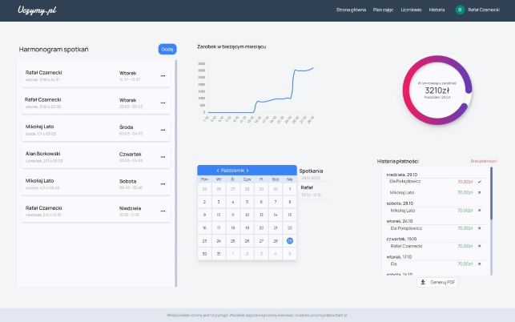
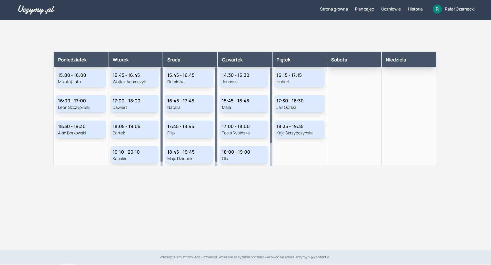
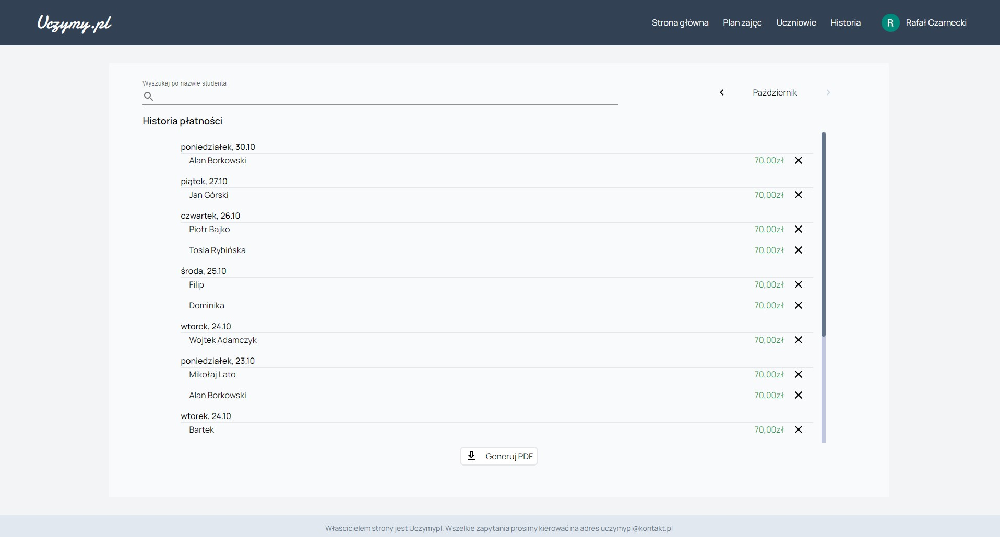
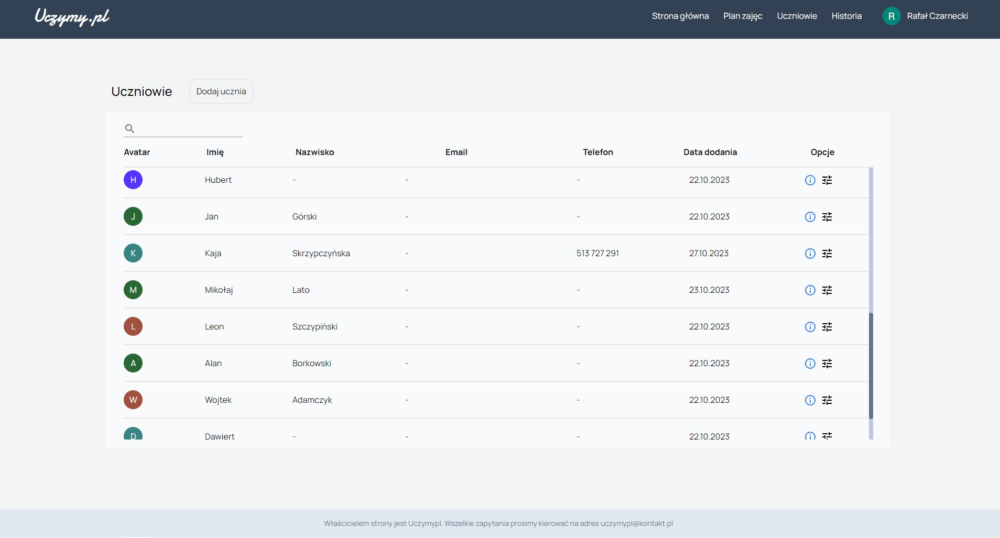
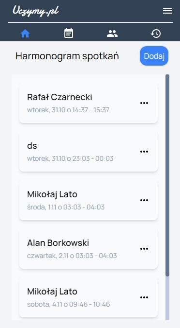

# Uczymy.pl
 Demo: https://uczymypl.vercel.app/
## About the project
Uczymy.pl is a website addressed to tutors. 
The main goal is to faciliate managment and lesson planning. 
# technologies
NextJs, ReactJs, Tailwind, mongoDb.
## overview 
 **Dashboard**- Main page where are rendered the most important information.

**Schedule**- Application generates schedule thanks to students base

**Payments**- User is able to monitor lesson payment status

**Students**- Find and change user's student

## Responsive web design
# Website is adapted for any device
